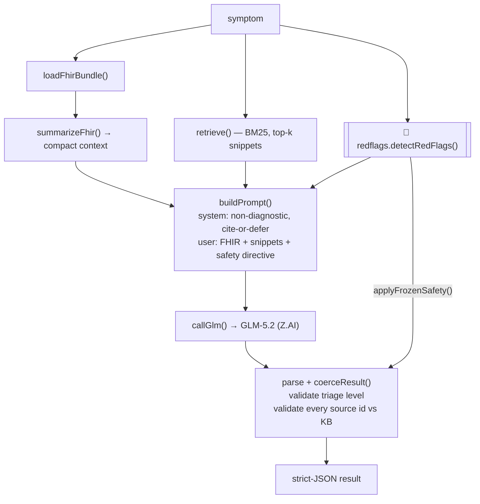

# Architecture

The agent is a small, readable pipeline. The point of this document is to make
the **safety model** auditable, because that is what a medical-AI buyer (or
their reviewing AI) will pressure-test.

## Control flow

## The frozen safety node (`lib/redflags.mjs`)

A deterministic, keyword/pattern red-flag detector. It is **not** a prompt and
**not** something the model can rewrite. It classifies the raw complaint against
hardcoded categories:

- acute coronary syndrome / chest pain
- stroke (F.A.S.T.)
- anaphylaxis
- severe respiratory distress
- pulmonary embolism
- suicidal ideation / self-harm
- sepsis, meningitis, thunderclap headache
- hypertensive emergency, DKA, GI bleed
- cauda equina, ectopic pregnancy

It runs **twice around the model**:

1. **Before** — its output is injected into the prompt as a hard directive
   (`safetyDirective`) so the model aligns with it.
2. **After** — `applyFrozenSafety()` overrides the model's `triage` to
   `EMERGENCY` if any flag matched, guarantees the escalation line is present in
   `redFlags`, strips any definitive-diagnosis phrasing (`you have`, `diagnosis
   is`, `confirmed`, `definitely`) from the model's reasoning, and appends a
   deferral.

This means a model that under-triages a flagged emergency still emits
`EMERGENCY` + escalation + refusal. The optimizer cannot relax it without
editing `lib/redflags.mjs` itself.

## Why the model can still be wrong on purpose — and why that's OK here

The frozen node is deliberately conservative: it favors a false-positive
emergency over a missed one. The model is still asked to reason and cite, so
*cited* clinical nuance flows through to the output — but the *floor* on safety
is set by code, not by prose.

## Citation grounding (`coerceResult`)

Every `reasoning[].source` is checked against the KB's known ids. Anything that
isn't a known id is rewritten to `"no source"`, and the UI/CLI renders that
distinctly so a reviewer can see which claims are unsupported. The model is also
instructed that uncited claims must defer to a clinician.

## Retrieval (`lib/retrieve.mjs`)

A from-scratch BM25 scorer over `kb/guidelines.json` (title + body), with a
small safety hook that always surfaces respiratory/anaphylaxis knowledge for
breath-related queries so a critical snippet is never silently dropped by sparse
keyword overlap. Top-k (default 6) snippets become the model's citation set.

## FHIR (`fhir/sample-patient.json` + `summarizeFhir()`)

A synthetic FHIR R4 `Bundle` of type `collection`, tagged `SYNTHETIC`.
`summarizeFhir()` flattens `Patient`, active `Condition`s, `AllergyIntolerance`,
and `Observation`s into a compact text block (in the prompt) and a structured
object (in `meta.fhirUsedStructured`, for the UI). No PHI, ever.

## Provider contract

- Endpoint: `https://api.z.ai/api/coding/paas/v4/chat/completions`
- Model: `glm-5.2`
- Auth: `Bearer $ZAI_API_KEY` (never hardcoded; `.env` is gitignored)
- GLM-5.2 emits `reasoning_content` before `content`; `max_tokens` is budgeted
  to 4096 so reasoning + JSON both fit, and `temperature` is held at 0.2.

## Failure modes the code handles

- Missing `ZAI_API_KEY` → clear error before any network call.
- Model returns non-JSON or wrapped-in-fences output → `stripFences()` isolates
  the first `{…}` block, then `JSON.parse`; on failure a safe fallback result is
  returned **and then** the frozen node still runs, so a flagged emergency stays
  `EMERGENCY` even when the model call fails.
- Z.AI non-2xx → surfaced as a 502 from the API with the detail truncated.

The combination — frozen safety node + validated citations + conservative
fallback — is what makes this read as a triage *system* rather than a chatbot.
