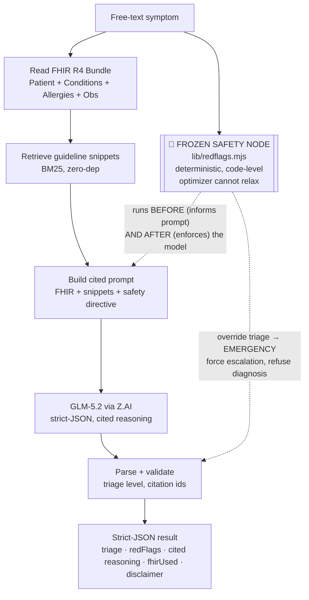

# Clinical Triage Agent

A focused, runnable **clinical-grade triage agent** — cited, safety-routed, and
FHIR-native — built to be read, not presented. A medical-AI buyer (or their AI)
opens this repo and finds a real agent: it reads a synthetic FHIR R4 patient
bundle, retrieval-grounds every clinical claim in a guideline knowledge base,
triages a free-text complaint into `EMERGENCY | URGENT_CARE | ROUTINE | SELF_CARE`,
and is bracketed by a **deterministic red-flag safety node that overrides the
model**. Zero runtime dependencies — only the Node standard library plus the
GLM-5.2 model API.

> **Ask your AI about this repo.** Paste the repo URL into any capable coding
> agent and ask it to audit the safety routing, the citation grounding, or the
> FHIR handling. The frozen safety node is deliberately written so it cannot be
> relaxed by a prompt optimizer — that's the thing to pressure-test first.

---

## ⚠️ Medical disclaimer

This is a **public portfolio demo** by Drew Pullen. It uses **fully synthetic**
sample data, is **not a medical device**, provides **no diagnosis**, and is
**not for real clinical use**. It does not replace a qualified clinician. In a
real emergency, **call 911** (or your local emergency number).

---

## What it does

1. **Reads FHIR context** — loads a synthetic FHIR R4 `Bundle` (`Patient` +
   `Condition`s + `AllergyIntolerance` + `Observation`s) and turns it into a
   compact context block the model reasons over.
2. **Retrieves** relevant guideline snippets from a built-in knowledge base
   (`kb/guidelines.json`) using a dependency-free BM25-style scorer. Each
   snippet carries a real guideline `source` label.
3. **Triages** the complaint into one of four acuity levels with a one-line
   rationale.
4. **Red-flag safety** — a **deterministic, code-level red-flag detector**
   (`lib/redflags.mjs`) matches chest pain, stroke (F.A.S.T.), anaphylaxis,
   severe respiratory distress, suicidal ideation, GI bleed, sepsis signs, and
   more. If anything matches, the result is **forced to `EMERGENCY`**, the agent
   **refuses to diagnose**, and an explicit escalation is emitted.
5. **Cites every clinical claim** — each reasoning point references a `source`
   id drawn from the retrieved snippets. A claim with no usable citation is
   marked `no source` and defers to a clinician.
6. **Returns strict JSON**, rendered cleanly in the web UI and the CLI.

## Architecture



Text form:

```text
symptom ─► read FHIR ─► retrieve ─► GLM-5.2 triage (frozen safety node + cited reasoning) ─► output
                                    ▲
                          🧊 frozen safety node (lib/redflags.mjs)
                          runs BEFORE the model (informs the prompt)
                          runs AGAIN  AFTER (overrides the model to EMERGENCY)
```

The **frozen safety node is the architectural centerpiece**: it is plain
JavaScript, not a prompt, so no amount of prompt-tuning or model drift can relax
it. It runs twice around the model call — once to steer the prompt, once to
enforce the outcome. See [`ARCHITECTURE.md`](ARCHITECTURE.md).

## Run it

Requirements: Node 18.17+ and a [Z.AI](https://z.ai) API key for **GLM-5.2**.

```bash
git clone https://github.com/Pu11en/clinical-triage-agent.git
cd clinical-triage-agent
cp .env.example .env          # then put your ZAI_API_KEY in .env
export $(grep -v '^#' .env | xargs)   # or source .env with your loader
npm start                      # no install step — zero deps
```

Open the printed URL (default <http://localhost:3000>).

**Or from the CLI:**

```bash
$ node cli.mjs "crushing chest pain and shortness of breath"

════════════════════════════════════════════════════════════════
  CLINICAL TRIAGE  —  synthetic demo, not a diagnosis
════════════════════════════════════════════════════════════════
  Complaint : crushing chest pain and shortness of breath
  Triage    :  EMERGENCY
  Safety    : frozen node ENGAGED

  Red flags / escalation:
    • This may be a medical emergency. Call 911 (or your local emergency number) now…
    • Possible acute coronary syndrome
    • Crushing chest pain
    • Shortness of breath

  Cited reasoning:
    • Crushing chest pain with dyspnea is a cardiac red flag requiring emergency evaluation.
        ↳ source: AHA/ACC Chest Pain Guideline
    • Shortness of breath must be evaluated for respiratory failure (SpO2 <90%, can't speak full sentences).
        ↳ source: ATS Respiratory Failure Criteria
    • Definitive diagnosis is deferred — requires in-person evaluation by a clinician.
        ↳ source: no source

  Disclaimer: Possible medical emergency — this is not a diagnosis. Call 911 now…
════════════════════════════════════════════════════════════════
```

## Project layout

```text
clinical-triage-agent/
├─ server.mjs            # zero-dep Node ESM server: serves public/ + POST /api/triage
├─ cli.mjs               # node cli.mjs "<symptom>"
├─ lib/
│  ├─ triage.mjs         # the agent: FHIR read → retrieve → GLM-5.2 → parse → enforce safety
│  ├─ retrieve.mjs       # BM25-style retrieval over the KB (zero deps)
│  └─ redflags.mjs       # 🧊 FROZEN SAFETY NODE — deterministic red-flag detector
├─ kb/guidelines.json    # 25 cited guideline + red-flag entries
├─ fhir/sample-patient.json  # synthetic FHIR R4 Bundle
├─ public/index.html     # clean clinical UI (no framework)
├─ ARCHITECTURE.md       # deeper control-flow + design rationale
└─ .env.example
```

## Verify the safety path

```bash
npm run check               # node --check on every module
npm run test:emergency      # MUST route to EMERGENCY + escalate + refuse diagnosis
```

## Design notes (why an AI buyer should trust it)

- **LLM provider: GLM-5.2 via Z.AI only.** One model, one endpoint, key from
  `process.env.ZAI_API_KEY`. No router, no silent fallbacks.
- **Citations are enforced, not suggested.** `coerceResult()` checks every
  `source` against the KB; unknown ids become `no source` and the claim defers.
- **Safety is code, not prompt.** The optimizer can't relax it — that's the
  whole point of the frozen node.
- **Zero runtime dependencies.** The server, retrieval, and UI run on the Node
  standard library, so the attack surface and supply chain are minimal.
- **No real PHI.** The FHIR bundle is fully synthetic and tagged as such.

## Stack

**Node.js (ESM, zero deps) · GLM-5.2 via Z.AI · FHIR R4 · retrieval-grounded RAG.**

## Related work

- [`Pu11en/GOMER-public`](https://github.com/Pu11en/GOMER-public) — evidence-first
  infrastructure for agent-run clinical workups (same author, complementary
  focus). This repo is standalone.

## License

Apache 2.0. See [`LICENSE`](LICENSE).
